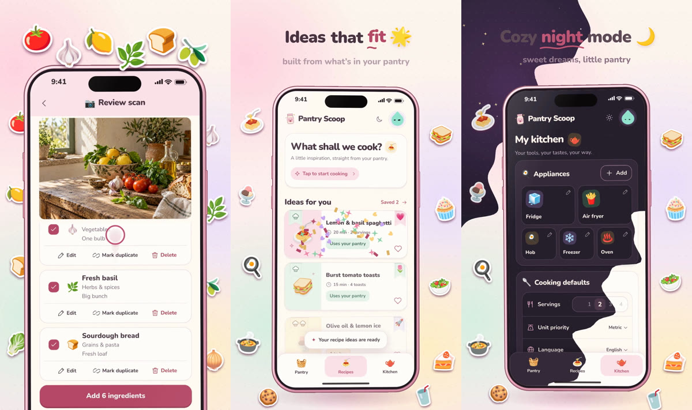

# Pantry Scoop promo video

`pantry-scoop-promo.mp4`: a 47-second vertical promo (1080×1920, 60 fps, H.264 with AAC stereo).



The phone shows real use of the app. One continuous session was recorded in Chrome's headless
shell on a 390×797 phone viewport at 3× resolution (plus a drawn status bar and home indicator).
It runs the actual HTTP app and frontend over an in-memory database with fake sign-in and
scripted AI answers. Nothing calls ChatGPT and no real account is touched. The story:

1. Kitchen setup with Scoop (tap Scoop for a tip, drop the microwave, finish setup)
2. Scanning a grocery photo, reviewing the eight detected ingredients and adding six
3. Marking avocados as used up, then "Sort with ChatGPT" for the Other shelf
4. Asking for cozy recipe ideas (servings, difficulty hats), the idea cards arriving, opening one
   and saving it
5. Switching to night mode from My kitchen

The edit around the phone is designed in HTML and rendered frame by frame. It has a pastel world
that the app's own theme wave turns to night, chapter captions, sticker sets for each chapter,
the finger, punch-in zooms, a polaroid of the scanned photo, ingredient stickers, confetti and
hearts. Scoop opens and closes the video. The soundtrack is synthesised: a ukulele and
glockenspiel tune that becomes a music-box lullaby at night, plus sound effects placed on the
same timeline as the visuals.

## How it is made

Needs Node ≥ 22.18, FFmpeg and Chromium's headless shell (the path is set in `cdp.mjs`).

```bash
# 1. Record the app (about 6 minutes): frames/ and capture.json
node --disable-warning=ExperimentalWarning design/demo/promo/capture.mjs /tmp/promo/frames 3
# 2. Lay out the stage once to write timeline.json (sound cues), then synthesise the soundtrack
node design/demo/promo/render.mjs /tmp/promo /tmp/promo/x.mp4 --stills /tmp/promo/stills --at 0
node design/demo/promo/audio.mjs /tmp/promo/timeline.json /tmp/promo/track.wav
# 3. Render the edit with the soundtrack (about 6 minutes)
node design/demo/promo/render.mjs /tmp/promo design/demo/promo/pantry-scoop-promo.mp4 --audio /tmp/promo/track.wav
```

- `world.mjs` builds the demo kitchen: the app, sample pantry, scan answer for
  `public/assets/pantry-editorial.webp`, recipe ideas and two saved recipes.
- `recorder.mjs` drives the page with frame-exact timing. Virtual time and BeginFrames advance
  together, so CSS animations, Web Animations, timers and smooth scrolling are captured at
  exactly 60 fps however slowly each frame renders. Taps are real CDP touch events with virtual
  timestamps. Drags move the real scroll container one frame at a time. Touch drags in the
  headless shell either drop movement to touch coalescing or stall frame control when the release
  starts a momentum fling.
- `capture.mjs` is the scenario. It logs taps, drags, chapters and the boxes the camera zooms to.
- `compose/` is the stage: `renderFrame(n)` draws output frame `n` from the footage and the log,
  and exports the sound cues.
- `render.mjs` serves the stage, steps it in the headless shell and pipes JPEG frames to FFmpeg.
- `audio.mjs` synthesises the soundtrack: a Karplus–Strong ukulele, FM glockenspiel, kalimba
  and music box, soft drums, and a small Schroeder reverb.
